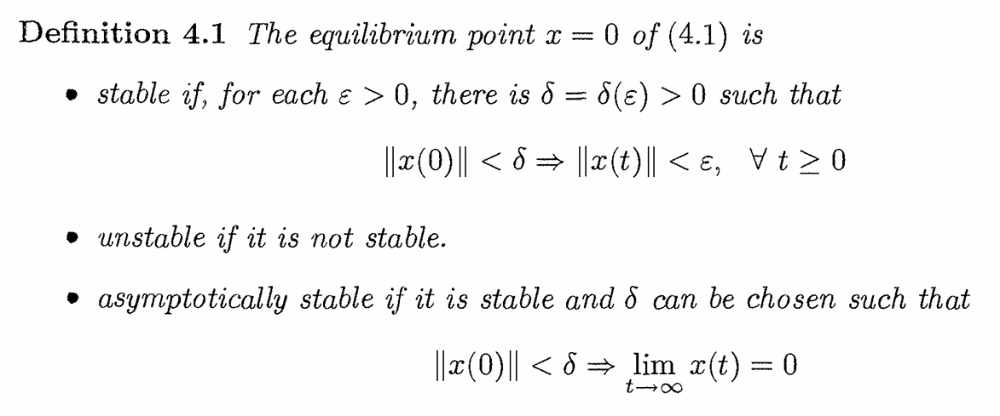
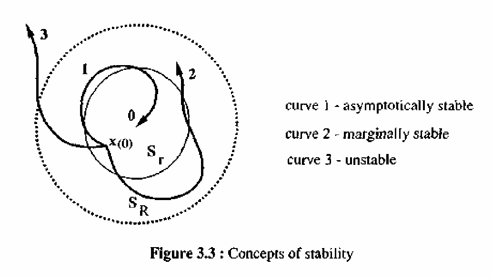
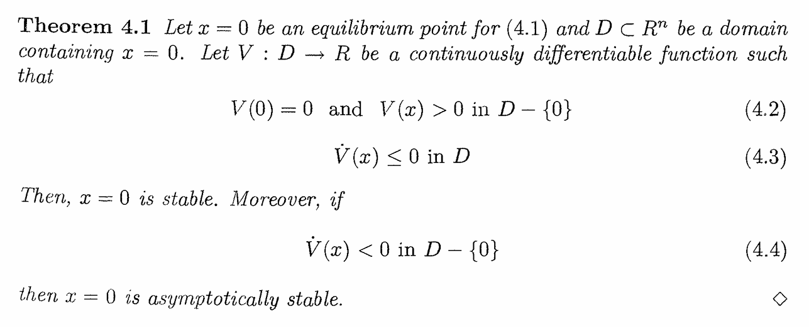
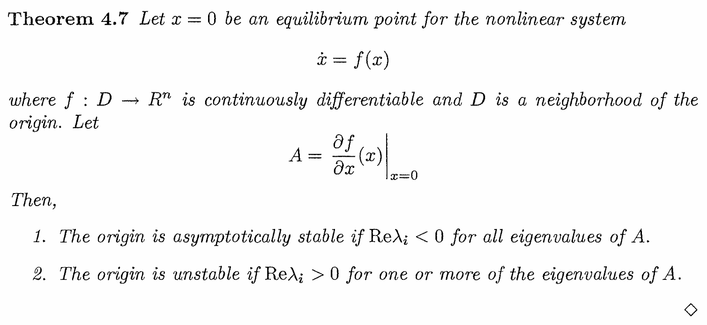
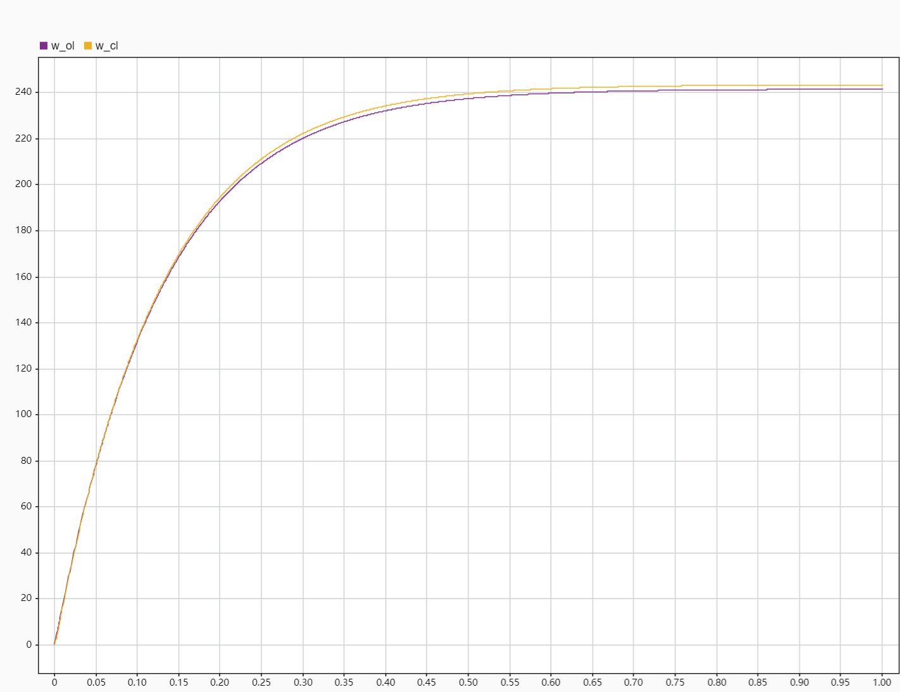
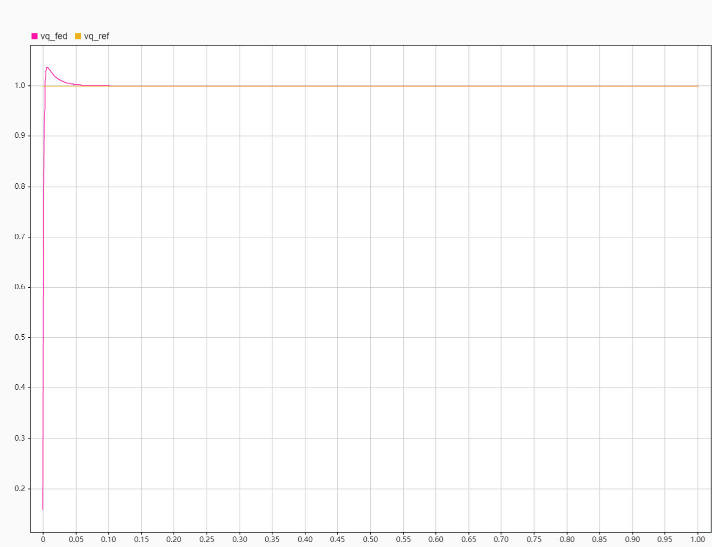
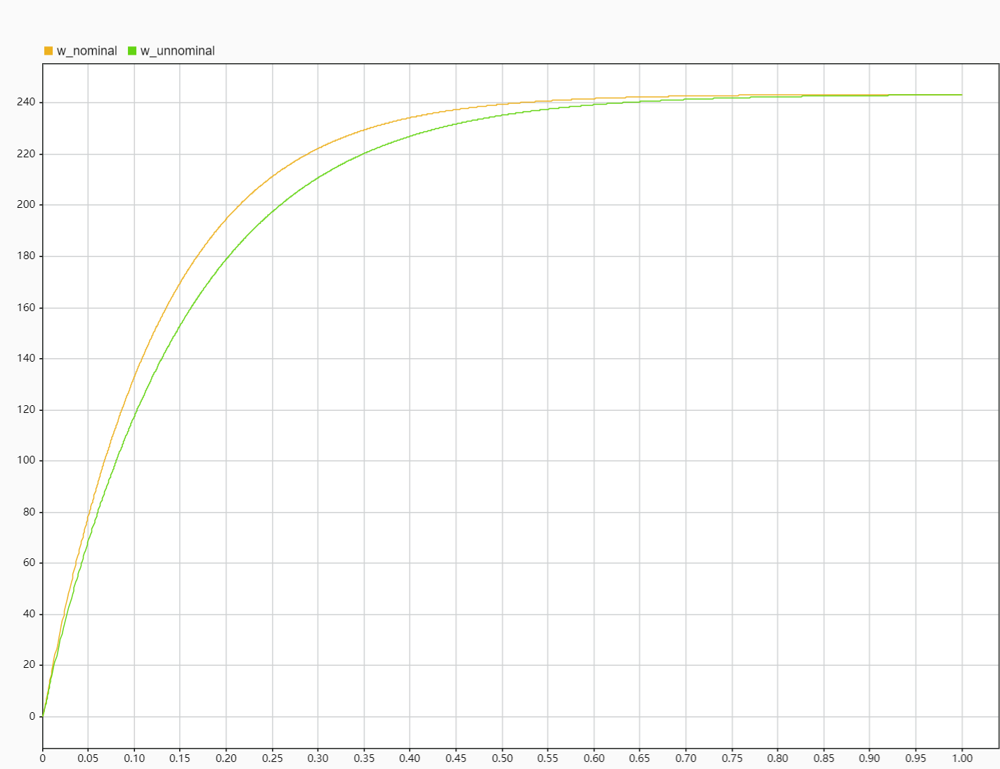

# 
动力电调稳定性分析

邓正雄

Abstract——电控系统是目前工业界最常见的控制系统。据我观察，目前大部分资料对电控系统的介绍是描述自身特定的算法框架，并没有给出系统稳定性的分析结果。目前大部分资料并不能从数学的层面上把电控系统的基本性质描述清楚，并且许多从业人员对控制理论的基本概念是不理解的。因此，本文从控制理论的角度，以动力电调作为例子，推导了动力电调开环和闭环稳定性分析结果，以说明控制理论是如何解决问题的。

[toc]

## Introduction

### Dynamical Systems

控制理论本质上是研究微分方程/动力系统（dynamical systems）。

$$\dot{x}_1 = f_1(t,x_1,\cdots,x_n,u_1,\cdots,u_p)\\
\dot{x}_2 = f_2(t,x_1,\cdots,x_n,u_1,\cdots,u_p)\\
 \vdots \\
\dot{x}_n = f_n(t,x_1,\cdots,x_n,u_1,\cdots,u_p)$$

上式是由有限个耦合的一阶常微分方程建模的动力系统。其中 $\dot{x}_i$ 表示 $x_i$ 对于时间变量 $t$ 的导数，$u_1,u_2,\cdots,u_p$ 是输入变量。$x_1,x_2,\cdots,x_p$ 是状态变量。我们通常会使用向量将方程写成紧凑的形式。定义如下：

$$x=\left[\begin {array}{c}
x_1 \\
x_2 \\
\vdots \\
\vdots \\
x_n
\end{array}\right],
u=\left[\begin {array}{c}
u_1 \\
u_2 \\
\vdots \\
u_p
\end{array}\right],
f(t,x,u)=\left[\begin {array}{c}
f_1(t,x,u) \\
f_2(t,x,u) \\
\vdots \\
\vdots \\
f_n(t,x,u)
\end{array}\right]$$
将n个一阶微分方程改写为一个n维的一阶向量微分方程
$$\dot{x} = f(t,x,u)\tag{1.1}$$
我们将（1.1）统称为状态空间模型。如果系统不存在输入且是时不变的，方程简化为
$$\dot{x} = f(x)\tag{1.2}$$

### Equilibrium Point

状态空间的一个重要概念是平衡点（equilibrium point）。如果状态空间中的点 $x = x^*$ 具有以下特性：每当系统的状态从 $x^*$ 出发，它将在未来所有时间保持在 $x^*$ 时，则称其为（1.2）的平衡点。对于时不变系统（1.2），平衡点是方程的实根
$$f(x)=0$$

### Lyapunov Stability
Lyapunov稳定性定义：

Lyapunov稳定性分析方法：

### Stabilization

镇定问题的定义，对于系统
$$\dot{x} = f(t,x,u)$$
设计一个反馈控制律
$$u = \gamma(t,x)$$
使得原点 $x = 0$ 是如下闭环系统的渐近稳定平衡点
$$\dot{x} = f(t,x,\gamma(t,x))$$

## Problem Formulation

### Notation

* $w$ 记为电机角速度
* $i_q$ 记为$q$轴电流
* $i_d$ 记为$d$轴电流
* $B$ 记为粘性阻尼系数
* $J$ 记为转动惯量
* $c$ 记为空气动力学参数
* $K_t$ 记为电机扭矩常数
* $R$ 记为相电阻
* $L_q$ 记为$q$轴电感
* $L_d$ 记为$d$轴电感
* $\phi_m$ 记为磁链常数
* $n$ 记为极对数
* $T_e$ 记为电磁扭矩
* $T_L$ 记为电磁扭矩
* $v_q$ 记为$q$轴输入电压
* $v_d$ 记为$d$轴输入电压

### Dynamic
系统动力学表示如下：
$$
\begin{aligned}
\dot{w} &= -\frac{B}{J}w+\frac{1}{J}T_e-\frac{1}{J}T_L\\
T_e &= \frac{3}{2}n[\phi_m i_q-(L_q-L_d)i_d i_q]\\
\dot{i}_d &= -\frac{R}{L_d}i_d + nw\frac{L_q}{L_d}i_q+\frac{1}{L_d}v_d\\
\dot{i}_q &= -nw\frac{L_d}{L_q}i_d - \frac{R}{L_q}i_q-\frac{n\phi_m}{L_q}w+\frac{1}{L_q}v_q\tag{2.1}
\end{aligned}
$$
基于上述模型，做进一步简化，我们令$i_d\equiv0$，方程如下：
$$
\begin{aligned}
\dot{w} &= -\frac{B}{J}w+\frac{K_t}{J}i_q-\frac{1}{J}T_L\\
\dot{i}_q &= - \frac{R}{L_q}i_q-\frac{n\phi_m}{L_q}w+\frac{1}{L_q}v_q\tag{2.2}
\end{aligned}
$$
考虑动力电调的负载扭矩特性，系统可进一步变为
$$
\begin{aligned}
\dot{w} &= -\frac{B}{J}w+\frac{K_t}{J}i_q-\frac{c}{J}w^2\\
\dot{i}_q &= - \frac{R}{L_q}i_q-\frac{n\phi_m}{L_q}w+\frac{1}{L_q}v_q\tag{2.3}
\end{aligned}
$$

## Control Design

动力电调的控制目标：
* 镇定 $v_q$

我们设计的控制器分为两部分：电流控制器和电压控制器，电流控制器用于控制电压控制器输出的给定电流。电压控制器用于输出给定电流。只要给定电流等于平衡点对应的电流，就能实现对系统平衡点的镇定。

定义给定目标$v_q^{ref}$，虚拟输入$i_q^{ref}$，引入积分控制
$$
\begin{aligned}
\dot{\sigma}_i &= i_q - i_q^{ref} \\
\dot{\sigma}_v &= v_q - v_q^{ref}
\end{aligned}
$$
定义参数$k_p^i、k_i^i、k_i^v$，控制律设计如下：
$$
\begin{aligned}
v_q &= -k_p^i*(i_q-i_q^{ref})-k_i^i\sigma_i\\
i_q^{ref} &= \frac{v_q^{ref}-\phi_m n w}{R}-k_i^v \sigma_v
\end{aligned}\tag{3.1}
$$

## Stability Analysis

本节中，将给出动力电调开环和闭环系统的稳定性结果。
设开环系统的平衡点$(w,i_q,v_q)=(w^*,i_q^*,v_q^∗)=(w^*,i_q^*,v_q^{ref})$。开环系统平衡点由下式求得
$$
\begin{aligned}
0 &= -\frac{B}{J}w^*+\frac{K_t}{J}i_q^*-\frac{c}{J}{w^*}^2\\
0 &= - \frac{R}{L_q}i_q^*-\frac{n\phi_m}{L_q}w^*+\frac{1}{L_q}v_q^*\tag{4.1}
\end{aligned}
$$
虽然标准的镇定问题被定义为平衡点在原点的镇定，但我们可以使用相同的描述来镇定系统在任意点 $x^*$。通过坐标变换
$$w^\delta=w-w^*,i_q^\delta=i_q-i_q^*,v_q^\delta=v_q-v_q^*$$
结合式（2.3）和（4.1）不难得出误差系统方程
$$
\begin{aligned}
\dot{w}^\delta &= -\frac{B}{J}w^\delta+\frac{K_t}{J}i_q^\delta-\frac{c}{J}{w^\delta}^2-\frac{2cw^*}{J}{w^\delta}\\
\dot{i}_q^\delta &= - \frac{R}{L_q}i_q^\delta-\frac{n\phi_m}{L_q}w^\delta\tag{4.2}
\end{aligned}
$$
对误差系统在原点 $(w^\delta,i_q^\delta) = (0,0)$ 线性化可得到
$$
\dot{x} = A_{ol}x
$$
其中，$x=[w^\delta,i_q^\delta]^T$，$
A_{ol} = \left[
\begin{array}{c}
-\frac{B+2cw^*}{J} & \frac{Kt}{J}\\
-\frac{n\phi_m}{Lq} & -\frac{R}{Lq}
\end{array}\right]$

**Proposition 1** *考虑动力学方程（2.3），开环系统的平衡点$(w,i_q,v_q)=(w^*,i_q^*,v_q^∗)=(w^*,i_q^*,v_q^{ref})$是（局部）指数稳定的*

**Proof:** 为了证明平衡点指数稳定，根据定理4.7，只需证明$A_{ol}$为Hurwitz矩阵。 

设闭环系统的平衡点$(w,i_q,v_q,\sigma_i,\sigma_v)=(w^*,i_q^*,v_q^∗,\sigma_i^*,\sigma_v^*)$。闭环系统平衡点由下式求得
$$
\begin{aligned}
0 &= -\frac{B}{J}w^*+\frac{K_t}{J}i_q^*-\frac{c}{J}{w^*}^2\\
0 &= - \frac{R}{L_q}i_q^*-\frac{n\phi_m}{L_q}w^*+\frac{1}{L_q}v_q^*\\
0 &= i_q^* - {i_q^{ref}}^*\\
0 &= v_q^* - v_q^{ref}\\
v_q^* &= -k_i^i\sigma_i^*\\
{i_q^{ref}}^* &= \frac{v_q^{ref}-\phi_m n w^*}{R}-k_i^v \sigma_v^*\tag{4.3}
\end{aligned}
$$
通过坐标变换
$$w^\delta=w-w^*,i_q^\delta=i_q-i_q^*,\sigma_{i}^\delta=\sigma_{i}-\sigma_{i}^*,\sigma_{v}^\delta=\sigma_{v}-\sigma_{v}^*$$
结合式（2.3）和（4.3）不难得出误差系统方程
$$
\begin{aligned}
\dot{w}^\delta &= -\frac{B}{J}w^\delta+\frac{K_t}{J}i_q^\delta-\frac{c}{J}{w^\delta}^2-\frac{2cw^*}{J}{w^\delta}\\
\dot{i}_q^\delta &= -(\frac{k_p^i}{R}+1)\frac{n\phi_m}{L_q}w^\delta - \frac{R+k_p^i}{L_q}i_q^\delta - \frac{k_i^i}{L_q}\sigma_{i}^\delta - \frac{k_p^i k_i^v}{L_q}\sigma_{v}^\delta\\
\dot{\sigma}_i^\delta &= \frac{n\phi_m}{R}w^\delta+i_q^\delta + k_i^v\sigma_{v}^\delta\\
\dot{\sigma}_v^\delta &= -\frac{k_p^i n\phi_m}{R}w^\delta-k_p^i i_q^\delta -k_i^i\sigma_{i}^\delta - k_p^i k_i^v\sigma_{v}^\delta\\\tag{4.3}
\end{aligned}
$$
对误差系统在原点 $(w^\delta,i_q^\delta,\sigma_i^\delta,\sigma_v^\delta) = (0,0,0,0)$ 线性化可得到
$$
\dot{x} = A_{cl}x
$$
其中，$x=[w^\delta,i_q^\delta,,\sigma_i^\delta,\sigma_v^\delta]^T$，$
A_{cl} = \left[
\begin{array}{c}
-\frac{B+2cw^*}{J} & \frac{Kt}{J} & 0 & 0\\
-(\frac{k_p^i}{R}+1)\frac{n\phi_m}{Lq} & -\frac{R+k_p^i} {Lq} & -\frac{k_i^i}{L_q} & - \frac{k_p^i k_i^v}{L_q}\\
\frac{n\phi_m}{R} & 1 & 0 & k_i^v\\
-\frac{k_p^i n\phi_m}{R} & -k_p^i & -k_i^i & -k_p^i k_i^v\\
\end{array}\right]$

**Proposition 2** *考虑动力学方程（2.3）以及控制律（3.1），闭环系统的平衡点$(w,i_q,v_q,\sigma_i,\sigma_v)=(w^*,i_q^*,v_q^∗,\sigma_i^*,\sigma_v^*)$是（局部）指数稳定的*

**Proof:** 为了证明平衡点指数稳定，根据定理4.7，只需证明$A_{cl}$为Hurwitz矩阵。 

## Simulation Results

在本节中，我们通过仿真验证控制器的有效性。
* **Simulation 1** - 当参数不存在不确定性，开环和闭环响应对比

* **Simulation 2** - 当参数存在不确定性，闭环响应对比

## Conclusion

本文对动力电调的开环和闭环系统进行稳定性分析。然而稳定性只是最基本的问题，在此之上进一步考虑鲁棒性、扰动抑制等问题，以及在工程中遇到的问题如何抽象成控制目标进行分析。

## Reference

* H. Khalil, *Nonlinear Systems 3rd edition.* New Jersey: Prentice Hall, 2002.